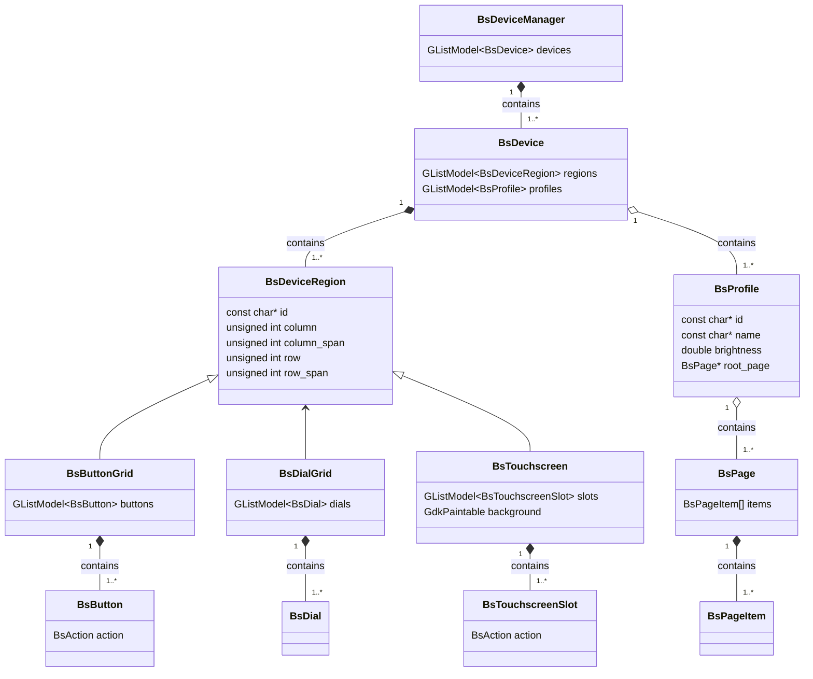

```mermaid

classDiagram
    
    class BsDeviceManager {
        GListModel~BsDevice~ devices
    }

        class BsDevice {
            GListModel~BsDeviceRegion~ regions
            GListModel~BsProfile~ profiles
        }
        BsDeviceManager "1" *-- "1..*" BsDevice : contains

            class BsDeviceRegion {
                const char* id
                unsigned int column
                unsigned int column_span
                unsigned int row
                unsigned int row_span
            }
            BsDevice "1" *-- "1..*" BsDeviceRegion : contains

                class BsButtonGrid {
                    GListModel~BsButton~ buttons
                }
                BsDeviceRegion <|-- BsButtonGrid

                    class BsButton {
                        BsAction action
                    }
                    BsButtonGrid "1" *-- "1..*" BsButton : contains

                class BsDialGrid {
                    GListModel~BsDial~ dials
                }
                BsDeviceRegion <-- BsDialGrid

                    class BsDial {
                    }
                    BsDialGrid "1" *-- "1..*" BsDial : contains

                BsDeviceRegion <|-- BsTouchscreen

                class BsTouchscreen {
                    GListModel~BsTouchscreenSlot~ slots
                    GdkPaintable background
                }

                    class BsTouchscreenSlot {
                        BsAction action
                    }
                    BsTouchscreen "1" *-- "1..*" BsTouchscreenSlot : contains


            class BsProfile {
                const char* id
                const char* name
                double brightness
                BsPage* root_page
            }
            BsDevice "1" o-- "1..*" BsProfile : contains

            class BsPage {
                BsPageItem[] items
            }
            BsProfile "1" o-- "1..*" BsPage : contains

                class BsPageItem {
                }
                BsPage "1" *-- "1..*" BsPageItem : contains
```
